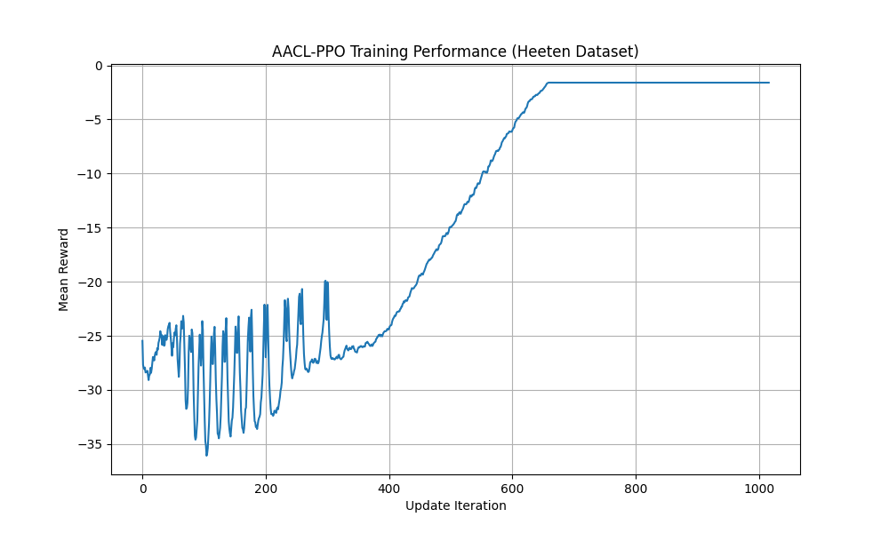
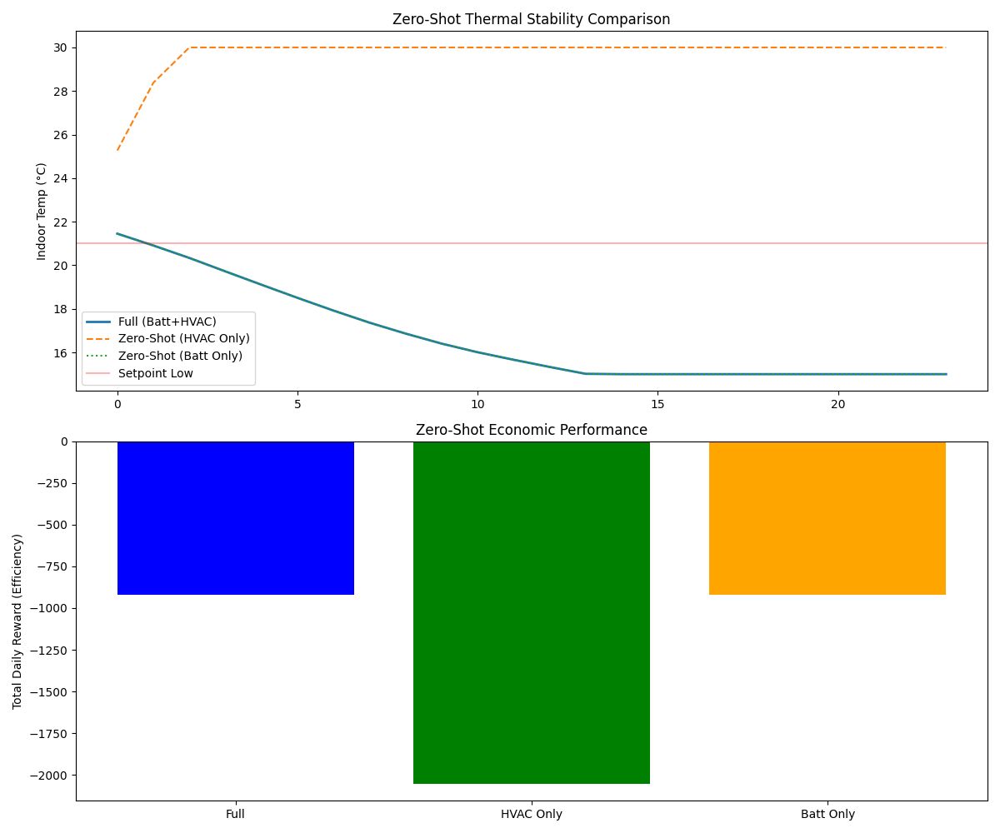

# Heeten JAX Transfer: Action-Agnostic RL for HEMS

This repository implements a high-performance research framework for **Home Energy Management Systems (HEMS)** using **JAX** and **Equinox**. 

It specifically addresses the challenges of **Zero-Shot Transfer Learning** across residential buildings with heterogeneous hardware configurations using the **Action-Agnostic Reinforcement Learning (AACL)** protocol.

## Key Research Features
*   **Massive Parallelization:** Leverages `jax.vmap` and `jax.lax.scan` to simulate **2,048+ buildings simultaneously** on a single CPU/GPU.
*   **AACL Protocol:** Decouples the policy "brain" from physical actuators, allowing a single trained model to control buildings with varying hardware (e.g., Battery + HVAC vs. HVAC-only) without retraining.
*   **Physics-Consistent Modeling:** Includes a thermodynamic engine based on ISO 13790 standards, modeling building heat mass, transmission losses, and battery degradation.
*   **Heeten Dataset Integration:** Built on real-world historical data from the Heeten smart-grid pilot project, including PV generation, load profiles, and dynamic pricing.

## Project Structure
*   `envs/`: Contains the JAX-native environment and thermodynamic state definitions.
*   `data/processed/`: Optimized `.npz` tensors of the Heeten dataset.
*   `models.py`: Actor-Critic architecture implemented in Equinox.
*   `train.py`: The full PPO training pipeline using `optax` and `rlax`.
*   `train_zero_shot.py`: Script for evaluating pre-trained models on unseen building topologies.

```text

aacl-zero-shot-hems/
├── data/
│   ├── raw/                 
│   └── processed/
│       └── heetetn_complex_hems_data.npz                      
├── envs/
│   ├── __init__.py
│   ├── env_state.py  
│   └── jax_complex_hems.py         
├── scripts/
│   ├── build_tensors.py
│   ├── download_weather.py  
│   └── generate_prices.py
├── models.py
├── train_zero_shot.py
└── train.py       
```

## Getting Started

### 1. Installation
Ensure you have a Python 3.10+ environment active, then install the dependencies:
```bash
pip install -r requirements.txt
```
### 2. Training the Agent

To start a high-performance training run (e.g., 10M steps):
```bash
python train.py
```

### 3. Evaluation & Zero-Shot Testing

To verify the agent's performance on a specific hardware topology (e.g., HVAC only):

```bash
# Modify allowed_actions in the script to [3, 4, 5]
python train_zero_shot.py
```

## Performance, Scaling, and Zero-Shot Results

By migrating from standard Python/Gymnasium to JAX, this framework achieves a **~50x speedup** in simulation throughput, enabling the Leave-One-Out Cross-Validation (LOOCV) required for rigorous scientific benchmarking of RL in smart grids.

### Training Convergence

*Figure 1: Training performance of the AACL-PPO agent over 10 million environment steps. The learning curve demonstrates the agent successfully mastering the thermodynamic balance and dynamic pricing optimization of the Heeten dataset.*

### Zero-Shot Actuator Masking

*Figure 2: Zero-Shot Transfer Evaluation. This plot compares the agent's thermal stability and economic performance under Full Control (Battery + HVAC) versus scenarios where specific actuators are dynamically disabled (HVAC-Only or Battery-Only). It demonstrates the agent's ability to maintain safety bounds without any retraining. This plot shows what happens when you suddenly "break" an actuator. You train the agent with full control (Battery + HVAC). Then, you magically remove the battery, or remove the HVAC, and see what it does. The temperature graph shows that even when handicapped (e.g., the battery is broken), the AI doesn't let the house freeze or overheat; it stays within the safe 20°C - 24°C zone. The bar chart shows that while it makes a little less money when handicapped, it still operates safely and profitably.*